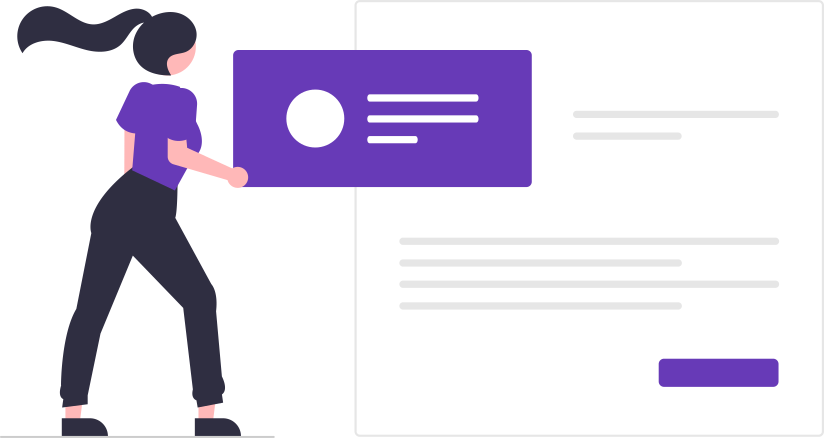

  <a href="account-settings.html" class="card">
    
    

      
Account Settings

      

        Adjust settings, manage notifications and learn about managing your profile.
      

    

  </a>
  <a href="login-password" class="card">
    
    

      
Login and Password

      
Fix login issues and learn how to change or reset your password.

    

  </a>
  <a href="/class-schedule" class="card">
    
    

      
Class Schedule

      
Create and manage your school programs and weekly classes.

    

  </a>
  <a href="forms-designer" class="card">
    
    

      
Forms Designer

      
Design custom forms to collect information from parents.

    

  </a>

